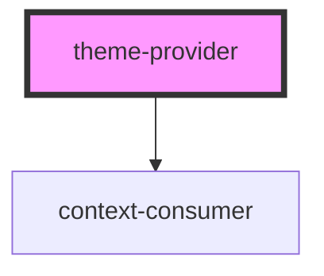

# theme-provider

<!-- Auto Generated Below -->

## Properties

| Property | Attribute | Description | Type                                                                   | Default                                                                                                |
| -------- | --------- | ----------- | ---------------------------------------------------------------------- | ------------------------------------------------------------------------------------------------------ |
| `theme`  | --        |             | `{ background: string; MyComponent: { root: { margin: string; }; }; }` | `{     background: "black",     MyComponent: {       root: {         margin: "16px"       }     }   }` |

## Dependencies

### Depends on

- context-consumer

### Graph

----------------------------------------------

*Built with [StencilJS](https://stenciljs.com/)*
